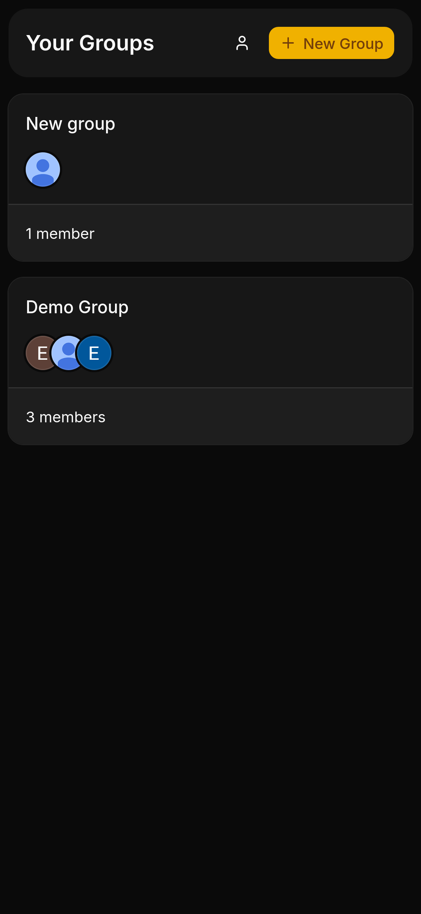
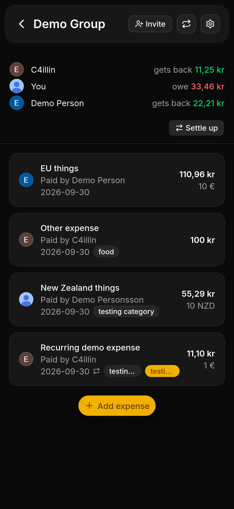

# OpenSplit

A self-hosted web application for splitting bills and expenses with friends. Only Google oauth is supported for authentication, but only UI is needed for more providers, as PocketBase supports many more providers out of the box. Currencies are fetched from European Central Bank (ECB) and therefore supports all currencies that are supported by ECB.

### Payment methods:

- Revolut
  - Which supports payments with card and apple pay.
- Swish (🇸🇪)
- Vipps/Mobilepay (🇳🇴🇸🇪🇩🇰🇫🇮)

More can be added, submit a PR or issue!

## Screenshots

<p align="center">
  <a href="https://raw.githubusercontent.com/c4illin/opensplit/main/docs/screenshots/overview.png">
    
  </a>
  <a href="https://raw.githubusercontent.com/c4illin/opensplit/main/docs/screenshots/group-screen.png">
    
  </a>
</p>

## Install

```yaml
services:
  opensplit:
    image: ghcr.io/c4illin/opensplit:main
    container_name: opensplit
    restart: always
    ports:
      - 5050:5050
    environment:
      - TZ=Europe/Stockholm
      - VAPID_SUBJECT=yourmail@example.org
    volumes:
      - ./data/opensplit:/pb/pb_data
```

Then after the service is running, view the logs (e.g. `docker compose logs -f opensplit`) to see the URL for the admin panel and the generated credentials. Log in to pocketbase and configure google auth.

## Development

0. Install git and [Mise](https://mise.jdx.dev/)
1. Clone repo, `mise up` and then `vp i`
2. Start development server with `vp run dev`
